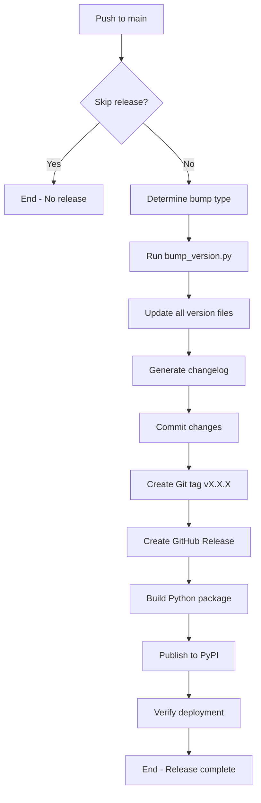

# Version Management System - CCG

**Project:** Conventional Commits Generator (CCG)
**Current Version:** 2.2.8
**Last Audit:** 2025-10-19

---

## Overview

This document describes the complete version management system for CCG, including all files that reference the version, the automated update process, and the release workflow.

---

## Version Source of Truth

The **single source of truth** for the CCG version is:

```
src/ccg/__init__.py → __version__ = "X.X.X"
```

All other version references are **derived** from this file during the release process.

---

## Files Updated Automatically

The following files are automatically updated by `scripts/bump_version.py` during each release:

### 1. **src/ccg/__init__.py**
**Pattern:** `__version__ = "X.X.X"`
```python
__version__ = "2.2.8"
```

### 2. **pyproject.toml**
**Pattern:** `version = "X.X.X"`
```toml
[project]
name = "conventional-commits-generator"
version = "2.2.8"
```

**Note:** While `pyproject.toml` has `version =` field, Hatch is configured to use `src/ccg/__init__.py` as the source:
```toml
[tool.hatch.version]
path = "src/ccg/__init__.py"
```

### 3. **.github/SECURITY.md**
**Pattern:** Supported versions table
```markdown
| >= X.0.0   | ✅     |
| <= (X-1).x.x   | ❌     |
```

### 4. **docs/user-guide/usage.md**
**Pattern:** Log format example
```
2025-10-13 23:58:34 - ccg.cli - INFO - main:123 - CCG started (version X.X.X)
```

### 5. **CHANGELOG.md**
**Pattern:** New release section
```markdown
## [X.X.X] - YYYY-MM-DD

### Added
- Feature description

### Changed
...
```

### 6. **docs/community/changelog.md**
**Pattern:** Synced copy of CHANGELOG.md

---

## Files That Reference Version Dynamically

These files reference the version at runtime and **do NOT need manual updates**:

### 1. **README.md**
Uses PyPI badge that auto-updates:
```markdown

```

### 2. **All Documentation Installation Commands**
Generic installation without version pinning:
```bash
pipx install conventional-commits-generator
pip install conventional-commits-generator
```

These automatically install the latest version from PyPI.

### 3. **CLI `--version` flag**
Reads version from `__init__.py` at runtime:
```python
# cli.py
from ccg import __version__
parser.add_argument("--version", action="version", version=f"CCG {__version__}")
```

---

## Files That Should NOT Be Updated

### 1. **CODE_ANALYSIS.md**
This is a **snapshot** document created at a specific point in time.
The version reference indicates when the analysis was performed:
```markdown
**Versão Analisada:** 2.2.8
```
✅ **Action:** Leave as-is (historical reference)

### 2. **Git Tags**
Created automatically by the release workflow:
```bash
git tag -a "vX.X.X" -m "Release vX.X.X"
```
✅ **Action:** Managed by `.github/workflows/deploy.yml`

---

## Automated Release Workflow

### Trigger
The release process is triggered automatically on **every push to `main` branch**, unless:
- Commit message contains `[skip-release]` or `[skip-deploy]`
- Changes are only to docs or configuration files

### Version Bump Strategy

The workflow automatically determines version bump type based on commit messages:

| Commit Pattern | Bump Type | Example |
|----------------|-----------|---------|
| `feat!:` or `BREAKING CHANGE` | **major** | 2.2.8 → 3.0.0 |
| `feat:` or `feat(scope):` | **minor** | 2.2.8 → 2.3.0 |
| `fix:`, `chore:`, `docs:`, etc. | **patch** | 2.2.8 → 2.2.9 |

### Workflow Steps



### Detailed Workflow

**File:** `.github/workflows/deploy.yml`

1. **Check Release Skip**
   - Examines commit message for `[skip-release]` flag

2. **Determine Bump Type**
   - Analyzes commit message patterns
   - Decides: major, minor, or patch

3. **Version Bump**
   ```bash
   python scripts/bump_version.py --type [patch|minor|major]
   ```

4. **Update Files**
   - `src/ccg/__init__.py`
   - `pyproject.toml`
   - `.github/SECURITY.md`
   - `docs/user-guide/usage.md`
   - `CHANGELOG.md` + `docs/community/changelog.md`

5. **Commit & Tag**
   ```bash
   git add -A
   git commit -m ":wrench: chore: bump version to X.X.X"
   git tag -a "vX.X.X" -m "Release vX.X.X"
   git push origin main vX.X.X
   ```

6. **Create GitHub Release**
   - Extract current version changelog
   - Create release with notes

7. **Build & Deploy**
   ```bash
   python -m build
   python -m twine upload dist/*
   ```

8. **Verify PyPI**
   ```bash
   pip install conventional-commits-generator==X.X.X
   ccg --version
   ```

---

## Manual Version Bump (Development/Testing)

For local testing or manual version bumps:

### Dry Run (No Changes)
```bash
python scripts/bump_version.py --type patch --dry-run
```

### Patch Bump (X.X.1)
```bash
python scripts/bump_version.py --type patch
```

### Minor Bump (X.1.0)
```bash
python scripts/bump_version.py --type minor
```

### Major Bump (1.0.0)
```bash
python scripts/bump_version.py --type major
```

**Output Example:**
```
📋 Current version: 2.2.8
🚀 New version: 2.3.0 (bump: minor)

📝 Updating files...
✅ Updated src/ccg/__init__.py with version 2.3.0
✅ Updated pyproject.toml with version 2.3.0
✅ Updated .github/SECURITY.md with version 2.3.0
✅ Updated docs/user-guide/usage.md with version 2.3.0
✅ Updated CHANGELOG.md with version 2.3.0
✅ Synced changelog to docs/community/changelog.md

🎉 Successfully bumped version to 2.3.0
```

---

## Version Verification Checklist

Before merging version bumps, verify:

- [x] `src/ccg/__init__.py` updated
- [x] `pyproject.toml` updated
- [x] `.github/SECURITY.md` updated
- [x] `docs/user-guide/usage.md` updated
- [x] `CHANGELOG.md` has new entry
- [x] `docs/community/changelog.md` synced
- [x] Git tag created (`vX.X.X`)
- [x] GitHub Release created
- [x] PyPI package published
- [x] PyPI shows correct version

### Quick Verification Commands

```bash
# Check version in source
python -c "import sys; sys.path.insert(0, 'src'); from ccg import __version__; print(__version__)"

# Check version in pyproject.toml
grep "^version = " pyproject.toml

# Check latest git tag
git describe --tags --abbrev=0

# Check PyPI version
pip index versions conventional-commits-generator | head -1
```

---

## Troubleshooting

### Problem: Version Mismatch Between Files

**Symptom:** Different versions in `__init__.py` and `pyproject.toml`

**Solution:**
```bash
# Re-run bump script to sync
python scripts/bump_version.py --type patch

# Or manually edit both files to match
```

### Problem: Release Workflow Failed

**Symptom:** GitHub Actions failed during deploy

**Solution:**
1. Check workflow logs in GitHub Actions tab
2. Common issues:
   - `PYPI_TOKEN` secret not set
   - Version already exists on PyPI
   - Build/test failures

### Problem: PyPI Deployment Verification Failed

**Symptom:** Can't install new version from PyPI

**Solution:**
```bash
# Wait 2-5 minutes for PyPI to sync
sleep 60

# Retry verification
pip install --upgrade conventional-commits-generator
ccg --version
```

---

## Adding New Version References

If you add a new file that references the version, update `scripts/bump_version.py`:

### Example: Adding a new documentation file

```python
def update_new_doc_file(new_version: str) -> None:
    """Update version in docs/new-file.md."""
    doc_file = Path("docs/new-file.md")

    if not doc_file.exists():
        print(f"⚠️  {doc_file} not found, skipping")
        return

    content = doc_file.read_text()

    # Update version pattern (customize for your case)
    updated_content = re.sub(
        r"Version: \d+\.\d+\.\d+",
        f"Version: {new_version}",
        content,
    )

    doc_file.write_text(updated_content)
    print(f"✅ Updated {doc_file} with version {new_version}")

# Add to main():
def main():
    # ... existing code ...
    update_init_file(new_version)
    update_pyproject_toml(new_version)
    update_security_md(new_version)
    update_docs_usage_md(new_version)
    update_new_doc_file(new_version)  # Add here
    update_changelog_with_real_content(new_version)
```

---

## Best Practices

### 1. **Never Manually Edit Version**
❌ Don't manually edit version in files
✅ Always use `scripts/bump_version.py` or let CI do it

### 2. **Use Semantic Versioning**
- **MAJOR** (X.0.0): Breaking changes
- **MINOR** (0.X.0): New features, backward compatible
- **PATCH** (0.0.X): Bug fixes, backward compatible

### 3. **Tag Format**
Always use `vX.X.X` format (e.g., `v2.3.0`)

### 4. **Changelog Quality**
- Use conventional commits for automated changelog
- Include `feat:`, `fix:`, `docs:`, etc. prefixes
- Add `!` for breaking changes: `feat!:`

### 5. **Testing Before Release**
```bash
# Test bump locally first
python scripts/bump_version.py --type minor --dry-run

# Verify changes
git diff
```

---

## Version History Tracking

All version changes are tracked in:

1. **Git Tags**: `git tag -l "v*"`
2. **CHANGELOG.md**: Human-readable changelog
3. **GitHub Releases**: https://github.com/EgydioBNeto/conventional-commits-generator/releases
4. **PyPI History**: https://pypi.org/project/conventional-commits-generator/#history

---

## Quick Reference

| Task | Command |
|------|---------|
| Check current version | `python -c "import sys; sys.path.insert(0, 'src'); from ccg import __version__; print(__version__)"` |
| Dry run version bump | `python scripts/bump_version.py --type patch --dry-run` |
| Bump patch version | `python scripts/bump_version.py --type patch` |
| Bump minor version | `python scripts/bump_version.py --type minor` |
| Bump major version | `python scripts/bump_version.py --type major` |
| List all tags | `git tag -l "v*"` |
| Check PyPI version | `pip index versions conventional-commits-generator` |
| Skip auto-release | Add `[skip-release]` to commit message |

---

## Contact & Support

For questions about version management:
- **GitHub Issues**: https://github.com/EgydioBNeto/conventional-commits-generator/issues
- **Discussions**: https://github.com/EgydioBNeto/conventional-commits-generator/discussions

---

**Document maintained by:** Project Maintainers
**Last updated:** 2025-10-19
**Next review:** After each major/minor release
